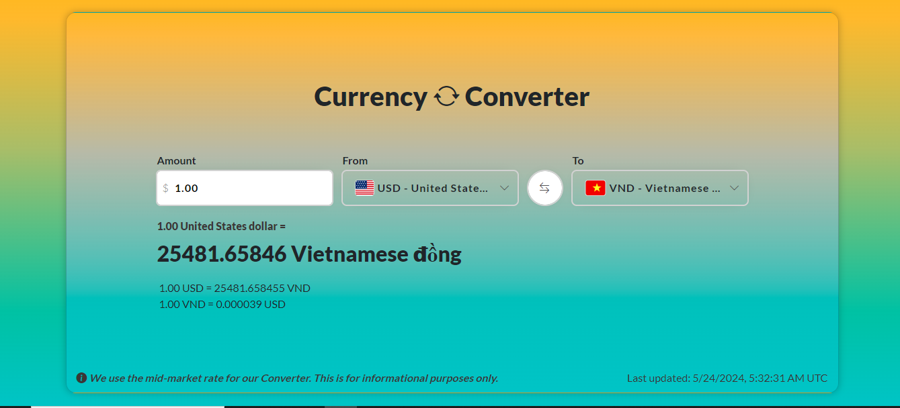

<h1 align="center"> Angular-Currency-Converter  </h1>

# CurrencyConverterApp

<a href="https://currencycconverter.vercel.app/" target="_blank">
    <h4>Demo</h4>
  </a>

<h4>Node Packages</h4>

<ul style="list-style-type:disc;">
  <li>npm i @ng-bootstrap/ng-bootstrap</li>
  <li>npm install currency-flags</li>
  <li>npm i bootstrap-icons</li>
</ul>
